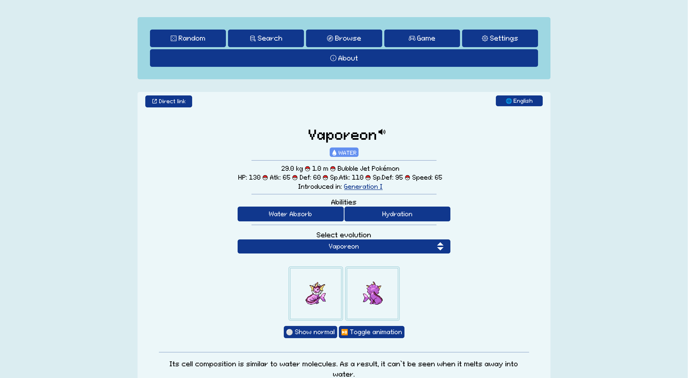

## [](https://www.ruby-lang.org/) [](LICENSE) [](Dockerfile) [](https://ci.codeberg.org/hexaitos/theriodex) [](https://theriodex.net)

**Theriodex** is an open-source Pokédex written in Ruby! It displays a random Pokémon with comprehensive information on the homepage, plus detailed data about moves, abilities, evolutions, and more. It even includes a small Pokémon guessing game. Designed to be fast, informative at a glance, and responsive on both mobile and desktop.

The name _Theriodex_ comes from `therio-` (Ancient Greek for "animal" or "beast") and `-dex` (reference to the Pokédex).

> **Note:** This is still very much a work in progress. Expect bugs, breakages, possible incorrect data, and frequent updates. Check `TODO.md` for planned features.

Try it out at [theriodex.net](https://theriodex.net)!

## Table of Contents

- [Features](#features)
- [Quick Start](#quick-start)
- [Installation](#installation)
- [Configuration](#configuration)
- [Development & Deployment](#development--deployment)
- [Acknowledgements](#acknowledgements)
- [Copyright](#copyright)

## Features

### Core Pokédex Information

- **(Nearly) Complete Coverage**: All standard 1000+ Pokémon through Generation IX
- **Move Learnsets**: Level-up, TM/HM, egg, and tutor moves with STAB highlighting and generation-specific changes
- **Ability Details**: Full ability descriptions including which Pokémon can have them
- **Lots and lots of sprites**: Default, shiny, and animated sprites and even version-specific sprites when viewing Pokémon by game version!

### Advanced Browsing

- **Multi-parameter Filtering**: Browse by type, generation, and more
- **Item Database**: Complete item listings with descriptions and effects
- **Search**: Fast fuzzy search across Pokémon and moves
- **Multilingual Support**: Interface localization with `lang` parameter support

### Guessing Game

- **"Who's That Pokémon?" Guessing Game**: Blurred sprite identification with adjustable difficulty
- **Generation Filtering**: Practise specific generations (e.g., "Only Gen 3")
- **Global Leaderboard**: Redis-backed score tracking with username persistence

### Customisation

- **Typography**: Multiple pixel fonts to choose from
- **Themes**: Various themes (some unlockable via gameplay)
- **Cursor Packs**: Various custom CSS cursors
- **View Modes**: Cards vs. table layouts for browsing

### Planned Features

- **Evolution Chains**: Visual trees with evolution methods (level, item, friendship, trade, etc.)
- **Daily Challenge Mode**: Wordle-style daily Pokémon challenge
- **Complete Coverage**: Including variants (Lycanroc, Oricorio) and Mega Evolutions
- **Improved Localization**: Completing the current implementation and working on moving over to another backend

## Quick Start

**Prerequisites:** Docker and Docker Compose installed on a supported operating system – mostly Linux or macOS (Windows might be supported but no guarantees!)

First, create a new folder with a `docker-compose.yml` file and edit it to include the following text. You may also use the `docker-compose.yml` file from this repository.

```yaml
services:
  theriodex:
    image: codeberg.org/hexaitos/theriodex:latest
    platform: linux/amd64
    ports:
      - "5678:5678"
    environment:
      - REDIS_HOST=redis
    depends_on:
      - redis
    volumes:
      - ./privacy.md:/usr/src/app/views/privacy.md

  redis:
    image: valkey/valkey:latest
    volumes:
      - redis_data:/data

volumes:
  redis_data:
```

Afterwards, create another file titled `privacy.md` in the same folder and copy your privacy policy into that file. You may also leave it empty if you do not wish to have one at all, **but you must change the privacy policy, you may not use the one included in this repository**.

You can then start Theriodex with the following command:

```bash
(sudo) docker compose up -d
```

Theriodex will be available at `http://localhost:5678` after the images have been downloaded. The `-d` flag makes it start as a daemon so that it all runs in the background and so that it autostarts when you start your computer / server. To make it available on the public Internet, please follow the instructions in the [Reverse Proxy](#reverse-proxy) section.

## Installation (advanced)

For most folk, the [Quick Start](#quick-start) should be sufficient to get started. If you want to run it without Docker or have different requirements (like using a different operating systems like OpenBSD), this section is for you.

### Docker

#### Pre-built Image (Recommended)

```bash
(sudo) docker run \
  --name theriodex \
  -e REDIS_HOST=REDIS_HOST_HERE \
  -p 5678:5678 \
  -d \
  codeberg.org/hexaitos/theriodex:latest
```

The container is `linux/amd64` only.

#### Building from Dockerfile

Clone the repository and build using the provided `Dockerfile` (follow standard Docker build procedures).

### From Source

**Requirements:** Ruby (tested with `4.0.1`) and Bundler.

1. Clone the repository
2. Run `bundle install` to install gems
3. Place the `sprites` folder in `/public/` (see [Sprites and Sounds](#sprites-and-sounds))
4. Start the server: `ruby server.rb`

#### Production Mode

```bash
# Production mode (listens on 0.0.0.0 automatically)
ruby server.rb -e production

# Or explicitly:
APP_ENV=production ruby server.rb -o 0.0.0.0
```

#### Custom Port/Address

- **Port:** `ruby server.rb -p 8080` (default: 4567)
- **Address:** `ruby server.rb -o 0.0.0.0` (default: localhost only)

#### Updating

```bash
# Stable version
git pull
# Restart server...

# Development version
git checkout dev
git pull
# Restart server...

# Return to stable
git checkout main
```

## Redis/Valkey

TODO

## Configuration

### Sprites and Sounds

Sprites and cries are served from local storage, not GitHub.

- **Sprites:** Download from [PokeAPI/sprites](https://github.com/PokeAPI/sprites/tree/4bcd17051efacd74966305ac87a0330b6131259a) (~1.5 GB) and place the `sprites` folder in `/public/`
- **Cries:** Download from [PokeAPI/cries](https://github.com/PokeAPI/cries) (~30 MB) and place the `cries` folder in `/public/`

You may also use the version that I am hosting myself. To do so, run the following command in the `theriodex` directory: `wget -qO- https://theriodex-data.s3.nl-ams.scw.cloud/main.tar.gz | gunzip | tar xvf - -C public --strip-components=1`.

_Note:_ Theriodex _should_ work without sprites but then, of course, it will not display any of the images.

### Database

The SQLite database (`db.sqlite3`) is derived from [PokeAPI](https://github.com/PokeAPI/pokeapi) and [Veekun's Pokédex](https://github.com/veekun/pokedex). You can rebuild it yourself using PokeAPI's instructions and replace the included database. No modifications have been made yet, though migrations may be required in the future.

### Leaderboard (Redis)

The guessing game uses Redis/Valkey for score tracking. Entries are stored in a sorted set `score` with format: `USERNAME-YYYYMMDDHHMMSS>RANDOM_HASH`.

**Configuration:**
Set the `REDIS_HOST` environment variable:

```bash
REDIS_HOST="localhost" ruby server.rb -e production
```

### Reverse Proxy

To make your version of Theriodex publicly accessible, you will most likely want to put it behind a reverse proxy. My preferred method of doing so is by using Caddy, as it makes the whole process rather simple!

Let us assume that you have a server or other device which has a public IP and which is currently not hosting anything else – ports 80 and 443 are available and open to the public; let us also assume that you own the domain theriodex.net and have entered your servers public IP addresses into your domain registrar so that theriodex.net points to the public IP address(es) of your server.

You can, then, simply install Caddy and use the following configuration assuming that you use the default port of 5678:

```caddyfile
theriodex.net {
	@assets path *.css *.js
	@images path *.png *.jpg *.jpeg *.gif *.svg *.webp *.ico
	@fonts path *.woff2 *.ttf

	header @assets Cache-Control "public, max-age=3600"
	header @images Cache-Control "public, max-age=2592000"
	header @fonts Cache-Control "public, max-age=2592000"

	reverse_proxy localhost:5678 {
		header_down -Cache-Control
	}

	encode zstd gzip
}
```

Caddy will automatically obtain an SSL certificate for you and in just a few moments, your website should be available under theriodex.net and have HTTPS enabled!

### Privacy Policy

This repo includes the privacy policy for my own hosted instance of Theriodex. This will obviously not apply to you, so if you wish to host it yourself, change the privacy policy under `/views/privacy.md` accordingly.

With Docker, mount your own policy:

```bash
docker run \
  -e REDIS_HOST="redis_host" \
  -p 5678:5678 \
  -v /path/to/your/privacy.md:/usr/src/app/views/privacy.md \
  theriodex
```

## Development & Deployment

### Auto-restart with `rerun`

The `rerun` gem auto-restarts the server when files change, useful for development or auto-updating deployments:

```bash
rerun -- ruby server.rb -e production
```

### Caching

Theriodex uses [rack-cache](https://github.com/rtomayko/rack-cache) for disk caching. Configuration is in `/app/helpers/vars.rb`:

```ruby
CACHE_DIR = "/tmp/cache/rack"
```

**Cache is cleared on server start** via this line in `server.rb`:

```ruby
FileUtils.remove_dir(CACHE_DIR) if Dir.exist?(CACHE_DIR)
```

#### Disabling Caching

Use the `no_rack_cache` environment:

```bash
ruby server.rb -e no_rack_cache
```

Or manually remove all `rack/cache` references, `cache_control` lines, and the `FileUtils.remove_dir` call from `server.rb`.

#### Memory Caching

Change the cache stores to heap (not recommended for production due to unbounded growth):

```ruby
use Rack::Cache,
  :metastore => 'heap:/',
  :entitystore => 'heap:/',
  :verbose => true
```

See [rack-cache documentation](https://rtomayko.github.io/rack-cache/storage) for details.

### Platform Notes (OpenBSD)

Tested on OpenBSD 7.6 and 7.7 with Ruby 3.3.5/3.4.2.

#### Nokogiri Issues

You should be able to install bundler itself without any problems, but when running `bundle install`, you may run into problems with installing `nokogiri`. To solve this, running the following commands should make it work:

```bash
pkg_add libxml libxslt libiconv
bundle config build.nokogiri --use-system-libraries
bundle install
```

#### Permission Errors (Non-root)

You may also have trouble installing the gems in the repository by running `bundle install` and will get permission errors, as Bundler is unable to write to the directories it wants to write to. A possible fix for this problem is changing the directory that Bundler installs its gems into to something that the current user can access, such as `~/.gem`. To do so, add the following to your `~/.profile`:

Add to `~/.profile`:

```bash
export GEM_HOME=$HOME/.gem
```

Or run:

```bash
echo 'export GEM_HOME=$HOME/.gem' >> $HOME/.profile
```

## Acknowledgements

A special and immense thanks to all my partners – who are way better at programming and database queries than I am – for helping me out a lot and answering my questions and giving helpful tips. I definitely would not have been able to get as far with this project if it hadn’t been for them. Thanks 🩵

Data sources:

- [PokeAPI](https://github.com/PokeAPI/pokeapi)
- [Veekun's Pokédex](https://github.com/veekun/pokedex)

Fonts:

- [GGBotNet](https://www.ggbot.net/)
- [VEXED](https://v3x3d.itch.io/)

Icons: [Iconoir](https://iconoir.com/)

> **Support the original creators!** Please consider donating to / buying the fonts and icons used in Theriodex if you are a frequent vistor of theriodex.net or if you wish to host it yourself.

## Copyright

Pokémon and Pokémon character names are trademarks of Nintendo, Game Freak, and Creatures Inc. Theriodex is not affiliated with, authorized, or endorsed by The Pokémon Company, Game Freak, Creatures, or Nintendo.

The project is licensed under the [3-Clause BSD License](https://opensource.org/license/bsd-3-clause).

- **Logic Loop font** (main font): [CC BY 4.0](https://creativecommons.org/licenses/by/4.0/) by [VEXED](https://v3x3d.itch.io/)
- **Pixeloid font** (glyphs): [CC0](https://creativecommons.org/public-domain/cc0/) by [GGBotNet](https://www.ggbot.net/)
- **Icons**: MIT License by [Iconoir](https://iconoir.com/)
